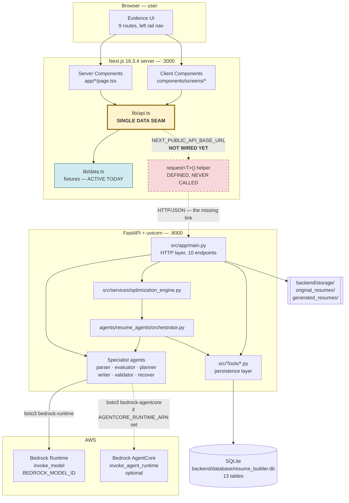
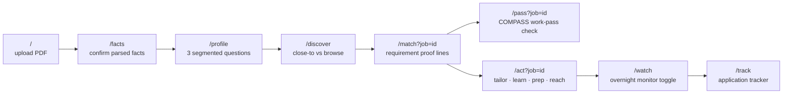
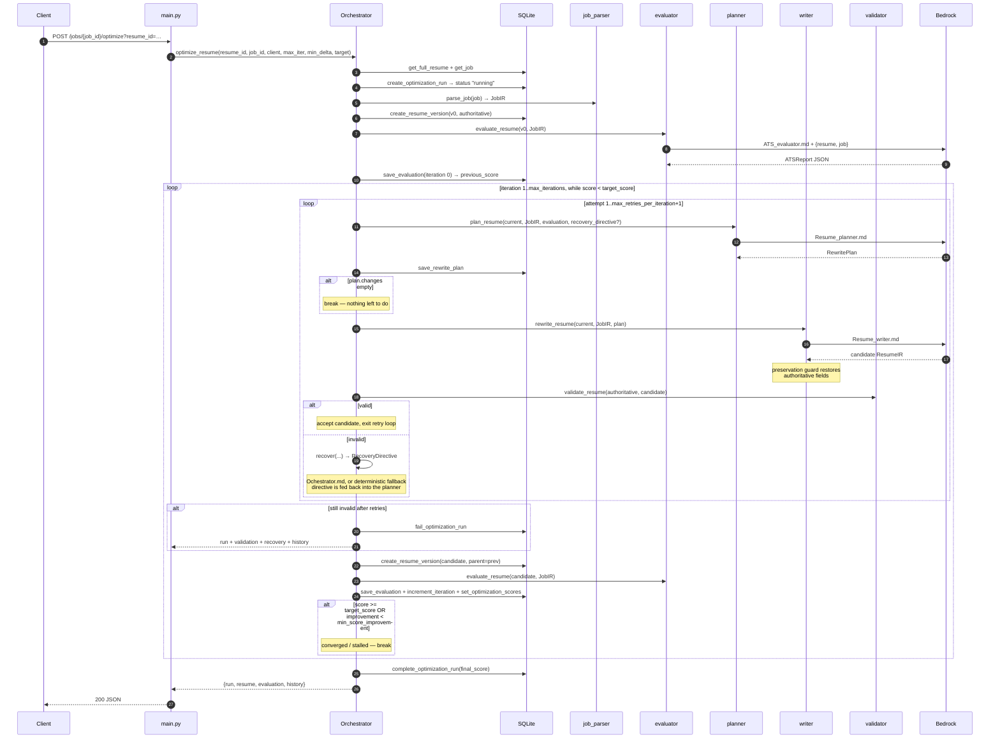
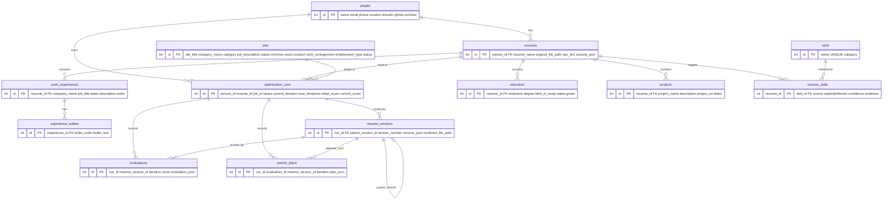
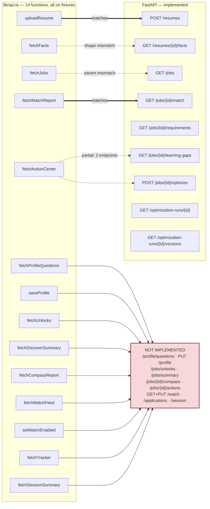
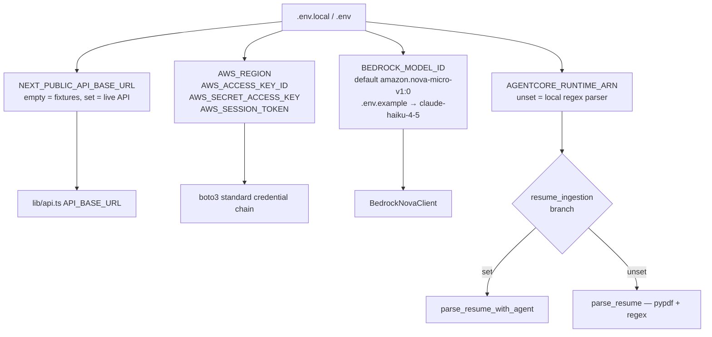

# Evidence / SimplifyNext — Technical Architecture

Analysis of the repo at branch `backend`. Everything below is derived from the code as it
stands, including the parts that are **not yet wired together**.

**The single most important structural fact:** the frontend and the backend are both real,
but they are **not connected**. Every function in `lib/api.ts` still returns fixture data from
`lib/data.ts`; the `request()` HTTP helper it defines is never called. The FastAPI service is
fully functional and never receives a request from the UI.

---

## 1. System context

### Stack

| Layer | Technology | Version / detail |
| --- | --- | --- |
| Frontend framework | Next.js App Router | 16.3.4 |
| UI runtime | React | 19.2.8 |
| Styling | Tailwind CSS v4 via `@tailwindcss/postcss` | tokens + shared classes in `app/globals.css` |
| Language (FE) | TypeScript 5 | strict, `@/*` path alias |
| Fonts | `next/font/google` — Archivo, IBM Plex Mono | CSS variables |
| Backend framework | FastAPI | `>=0.115,<1` |
| ASGI server | uvicorn[standard] | `>=0.34,<1` |
| Data validation | Pydantic models ("contracts") | via FastAPI dep |
| PDF extraction | pypdf | `>=5,<7` |
| Uploads | python-multipart | `>=0.0.20,<1` |
| Database | SQLite (stdlib `sqlite3`) | `backend/database/resume_builder.db` |
| LLM | AWS Bedrock Runtime via boto3 | default `amazon.nova-micro-v1:0`; `.env.example` sets Claude Haiku 4.5 |
| LLM (optional) | AWS Bedrock AgentCore | gated on `AGENTCORE_RUNTIME_ARN` |

---

## 2. Frontend architecture

```mermaid
graph LR
    subgraph Shell["app/layout.tsx — root shell"]
        RAIL["components/rail.tsx<br/>client, highlights current route"]
        CANVAS["main.canvas"]
    end

    subgraph Routes["app/ — one folder per route, async Server Components"]
        R1["/ &nbsp; upload"]
        R2["/facts"]
        R3["/profile"]
        R4["/discover"]
        R5["/match &nbsp; ?job="]
        R6["/pass &nbsp; ?job="]
        R7["/act &nbsp; ?job="]
        R8["/watch"]
        R9["/track"]
    end

    subgraph Screens["components/screens/ — client components"]
        S1["upload-drop.tsx"]
        S2["fact-list.tsx"]
        S3["profile-form.tsx"]
        S4["job-list.tsx"]
        S5["match-report.tsx"]
        S7["action-tabs.tsx<br/>tailor · learn · prep · reach"]
        S8["watch-toggle.tsx"]
    end

    UIKIT["components/ui.tsx<br/>Card · Tag · ButtonLink<br/>PageHeader · SectionHead · Nav"]
    API["lib/api.ts"]
    TYPES["lib/types.ts<br/>25 interfaces — the render contract"]
    DATA["lib/data.ts<br/>fixtures"]
    ROUTES["lib/routes.ts<br/>jobQuery&#40;&#41;"]

    Shell --> Routes
    RAIL --> API
    R1 --> S1
    R2 --> S2
    R3 --> S3
    R4 --> S4
    R5 --> S5
    R7 --> S7
    R8 --> S8
    Routes --> UIKIT
    Routes --> API
    Screens --> API
    Routes --> ROUTES
    API --> DATA
    API -.->|types| TYPES
    Routes -.->|types| TYPES
```

### User journey

### Rules the frontend follows

- Pages are **async Server Components** that `await` from `lib/api.ts`; only the interactive
  fragments in `components/screens/` are client components.
- `lib/data.ts` is **never imported by a component** — everything goes through `lib/api.ts`.
- `app/layout.tsx` calls `fetchStages()` and `fetchSessionSummary()` in a `Promise.all`, so the
  left rail is populated on every route.
- `/match`, `/pass`, `/act` read `?job=<id>` from `searchParams`; absent it, `lib/api.ts` falls
  back to `DEFAULT_JOB_ID`.
- Job IDs are **strings** on the frontend and **integers** in the backend — a real conversion
  point when wiring.

---

## 3. Backend architecture

```mermaid
graph TB
    subgraph HTTP["HTTP layer — src/app/main.py"]
        E1["POST /resumes"]
        E2["GET /resumes/{id}/facts"]
        E3["GET /jobs"]
        E4["GET /jobs/{id}/match"]
        E5["GET /jobs/{id}/requirements"]
        E6["GET /jobs/{id}/learning-gaps"]
        E7["POST /jobs/{id}/optimize"]
        E8["GET /optimization-runs/{id}"]
        E9["GET /optimization-runs/{id}/versions"]
        E10["GET /health"]
    end

    subgraph Service["Service layer"]
        ENG["services/optimization_engine.py<br/>optimize_resume&#40;&#41;"]
    end

    subgraph Orchestration["src/agents/resume_agents/orchestrator.py"]
        ORCH["ResumeOptimizationOrchestrator<br/>iteration loop + retry gate"]
        REC["recover&#40;&#41;<br/>LLM directive, deterministic fallback"]
    end

    subgraph Specialists["Specialist agents — thin, contract-validated"]
        JP["job_parser.parse_job<br/>regex IR, AgentCore optional"]
        EV["evaluator.evaluate_resume → ATSReport"]
        PL["planner.plan_resume → RewritePlan"]
        WR["writer.rewrite_resume → ResumeIR<br/>+ field preservation guard"]
        VA["validator.validate_resume → ValidationReport<br/>LLM or deterministic"]
    end

    subgraph Ingest["Ingestion"]
        ING["agents/resume_ingestion.ingest_resume"]
        RP["agents/resume_parser<br/>pypdf + section regex"]
    end

    subgraph Model["Model clients — swappable by Protocol"]
        BC["BedrockNovaClient<br/>generate_json&#40;&#41;"]
        ACC["AgentCoreClient"]
        PR["prompts/*.md<br/>ATS_evaluator · Resume_planner<br/>Resume_writer · Resume_reader · Ochestrator"]
    end

    subgraph Data["Persistence — src/Tools/*.py"]
        T1["person · resume · skill<br/>work_experience · education_project"]
        T2["job_tools · job_crud_tools"]
        T3["optimization · evaluation · plan"]
        CONN["database/database.py<br/>connection + schema init"]
    end

    DB[("SQLite")]
    CON["contracts.py<br/>ResumeIR · JobIR · ATSReport<br/>RewritePlan · ValidationReport<br/>RecoveryDirective"]

    E1 --> ING --> RP
    ING --> T1
    E7 --> ENG --> ORCH
    E3 --> EV
    E4 --> EV
    E4 --> T3
    E5 --> EV
    E6 --> EV
    E2 --> T1
    E8 --> T3
    E9 --> T3

    ORCH --> JP
    ORCH --> EV
    ORCH --> PL
    ORCH --> WR
    ORCH --> VA
    ORCH --> REC
    REC --> BC
    ORCH --> T3

    JP --> CON
    EV --> BC
    PL --> BC
    WR --> BC
    VA --> BC
    RP -.->|"if AGENTCORE_RUNTIME_ARN"| ACC
    JP -.-> ACC
    BC --> PR
    Specialists -.->|validate| CON
    T1 --> CONN
    T2 --> CONN
    T3 --> CONN
    CONN --> DB
```

### Design notes worth calling out

- **Every specialist is a Protocol-typed pure function.** `evaluate_resume`, `plan_resume`,
  `rewrite_resume`, `validate_resume` each take a `model_client` satisfying a one-method
  `Protocol`, so `BedrockNovaClient`, `AgentCoreClient`, or a test double are interchangeable.
- **The writer has a hard preservation guard.** After the LLM returns a candidate,
  `writer.py` restores `name`, `raw_text`, and any emptied `work_experience` / `education` /
  `projects` / `skills` / `certifications` from the authoritative resume before validating.
- **The validator has a deterministic fallback.** With no `model_client`, it string-matches every
  candidate skill, employer+title identity and date against the authoritative resume.
- **Nothing is persisted until validation passes.** The orchestrator only calls
  `create_resume_version` after `validation.valid` is true.
- **Two degradation paths:** no `AGENTCORE_RUNTIME_ARN` → local regex resume parser; no
  `orchestrate` method on the model client → deterministic `_fallback_recovery`.
- Bedrock failures surface as `BedrockClientError` → **HTTP 503** at every call site.

---

## 4. The optimization loop — the core algorithm

**Default knobs:** `max_iterations=3` (1–10), `min_score_improvement=2`, `target_score=85`,
`max_retries_per_iteration=2`. Termination is any of: target reached, plan produced no changes,
improvement below the floor, iteration budget spent, or validation failed after all retries.

---

## 5. Data model

`resume_versions` is a **parent-linked chain** per run, so the full lineage from v0 to the final
candidate is reconstructable; `GET /optimization-runs/{id}/versions` returns it plus adjacent
`{previous, current}` comparison pairs.

### Pydantic contracts (`contracts.py`) — the internal wire format

| Model | Purpose | Key fields |
| --- | --- | --- |
| `ResumeIR` | Canonical resume | name, email, phone, linkedin/github, summary, raw_text, work_experience[], education[], projects[], skills[], certifications[], other_sections |
| `JobIR` | Parsed job posting | title, company_name, original_description, required/preferred_skills, required/preferred_experience, responsibilities, education_requirements, technical/domain_keywords |
| `ATSReport` | Evaluator output | ats_score 0–100, summary, strengths, weaknesses, matched_skills, missing_skills, keyword_gaps, experience_gaps, ats_issues, high_priority_improvements |
| `RewritePlan` / `PlannedChange` | Planner output | strategy, changes[section, target, priority, action, instruction, reason], skills_to_emphasize, keywords_to_integrate, information_not_to_invent |
| `ValidationReport` / `ValidationIssue` | Truthfulness gate | valid, unsupported_additions[category, claim, reason], changed_dates, inflated_titles, summary |
| `RecoveryDirective` | Orchestrator repair instruction | failure_type, validation_failures, facts_to_restore, facts_to_preserve, unsupported_content_to_remove, planner_corrections, writer_constraints, retry_strategy |

---

## 6. API contract — implemented vs. expected

### Full matrix

| Frontend function | Endpoint the frontend expects | Backend today | Status |
| --- | --- | --- | --- |
| `uploadResume(file)` | `POST /resumes` multipart | `POST /resumes` — PDF only, ≤10 MB, returns `{resumeId, resume}` | **Match.** FE returns `{resumeId}`; BE also returns the parsed resume |
| `fetchFacts()` | `GET /resumes/:id/facts` → `FactGroup[]` | returns the whole `get_full_resume` record | **Shape mismatch** — needs a `FactGroup[]` projection; FE also passes no id |
| `fetchProfileQuestions()` | `GET /profile/questions` | — | **Missing** |
| `saveProfile(answers)` | `PUT /profile` | — | **Missing** |
| `fetchJobs(mode)` | `GET /jobs?mode=close\|browse` | `GET /jobs?resume_id&mode` — `mode` accepted but ignored; ranking driven by `resume_id` | **Param mismatch** |
| `fetchUnlocks()` | `GET /jobs/unlocks` | — | **Missing** (`/jobs/{id}/learning-gaps` returns adjacent `opportunities`, close in spirit) |
| `fetchDiscoverSummary()` | `GET /jobs/summary` | — | **Missing** |
| `fetchMatchReport(jobId)` | `GET /jobs/:id/match` → `MatchReport` | `GET /jobs/{id}/match?resume_id` returns jobId/jobTitle/company/location/verdict/verdictLabel/score/agents/requirements | **Match**, and the response was clearly shaped to `lib/types.ts` |
| `fetchCompassReport(jobId)` | `GET /jobs/:id/compass` | — | **Missing** — no COMPASS/work-pass logic anywhere in the backend |
| `fetchActionCenter(jobId)` | `GET /jobs/:id/actions` | `/jobs/{id}/learning-gaps` + `POST /jobs/{id}/optimize` | **Partial** — the "learn" tab has a source; tailor diffs, interview prep and outreach do not |
| `fetchWatchFeed()` | `GET /watch` | — | **Missing** — no scheduler/monitor exists |
| `setWatchEnabled(bool)` | `PUT /watch` | — | **Missing** |
| `fetchTracker()` | `GET /applications` | — | **Missing** — no `applications` table |
| `fetchSessionSummary()` | `GET /session` | — | **Missing** (called on every page via the root layout) |
| — | — | `GET /health` | Backend-only |
| — | — | `GET /jobs/{id}/requirements` | Backend-only; overlaps `/match` |
| — | — | `GET /optimization-runs/{id}` and `/versions` | Backend-only; no FE consumer |

### Verdict scale

Both sides use the same three-value scale, `lib/types.ts` `Verdict = "v" | "c" | "b"`.
`main.py` maps it from the ATS score: `>= 70 → "v"`, `>= 50 → "c"`, else `"b"`.

---

## 7. Configuration and runtime

**Run:** `npm run dev` → `:3000`. From `backend/`: `pip install -r requirements.txt` then
`uvicorn src.app.main:app --reload` → `:8000`. Schema is created on FastAPI startup via
`initialize_database()`, which also ensures `storage/original_resumes/`.

**Tests:** `backend/tests/` — `test_api.py`, `test_agent_workflow.py`, `test_pipeline.py`,
`test_resume_parser.py`, `test_tools.py`. Test doubles substitute for the model client through
the same `Protocol`s, so nothing calls Bedrock in tests.

---

## 8. Gaps to close before the two halves connect

1. **No CORS middleware in `main.py`.** Any browser-side `fetch` from `:3000` to `:8000` will be
   blocked. Server Components calling from the Node process are unaffected, so this only bites
   the client-component paths.
2. **`request()` sets `Content-Type: application/json` unconditionally**, which breaks the
   multipart `POST /resumes` upload — that call needs to bypass or override the header.
3. **ID type mismatch.** Frontend job/resume IDs are `string`; backend path params are `int`.
4. **No resume_id in the frontend's mental model.** `fetchFacts()`, `fetchMatchReport()` and the
   rest carry no resume identity; the backend requires `resume_id` on nearly every endpoint.
   Something has to hold the session's current resume — a cookie, a route param, or a `/session`
   endpoint.
5. **10 of 14 frontend data functions have no backend at all** — profile, unlocks, discover
   summary, COMPASS, watch, tracker, session.
6. **Cost shape of `GET /jobs?resume_id=`:** it runs one Bedrock ATS evaluation *per stored job*,
   serially, inside the request. Same for `/jobs/{id}/match`, `/requirements` and
   `/learning-gaps`, which each re-evaluate from scratch with no caching — despite `evaluations`
   being a persisted table that could serve as the cache.
7. **`POST /jobs/{id}/optimize` is synchronous** and runs up to `3 iterations × 3 attempts × 3
   LLM calls`. That is a minutes-long HTTP request; it wants a job queue plus the already-built
   `GET /optimization-runs/{id}` for polling.
8. **`@app.on_event("startup")` is deprecated** in current FastAPI — migrate to a `lifespan`
   handler.
9. **`GET /jobs/{id}/match` creates a new `optimization_run` + `resume_version` + `evaluation` on
   every call**, so simply viewing a match report writes three rows.
10. **Duplicate import** in `main.py`: `get_resume` is imported at module top and again inside
    `match_job`.

---

## 9. One-paragraph summary

Evidence is a two-process hackathon app. A Next.js 16 App Router frontend renders nine
evidence-first screens as Server Components, funnelling every data read through a single
placeholder module, `lib/api.ts`, which today resolves fixtures from `lib/data.ts`. A FastAPI
backend implements the real intelligence: it ingests a resume PDF with pypdf, normalises it into
a Pydantic `ResumeIR`, and runs a validated multi-agent optimization loop — job parser →
ATS evaluator → rewrite planner → writer → truthfulness validator, with an orchestrator that
issues a `RecoveryDirective` and retries whenever the validator catches a fabricated claim.
Every agent talks to AWS Bedrock through a swappable `Protocol`-typed model client, and every
iteration's version, evaluation and plan is persisted to a 13-table SQLite database so the whole
rewrite lineage is auditable. The two halves are architecturally compatible and deliberately
seam-designed, but not yet joined: only `POST /resumes` and `GET /jobs/{id}/match` line up
cleanly, and ten frontend data functions have no endpoint behind them.
